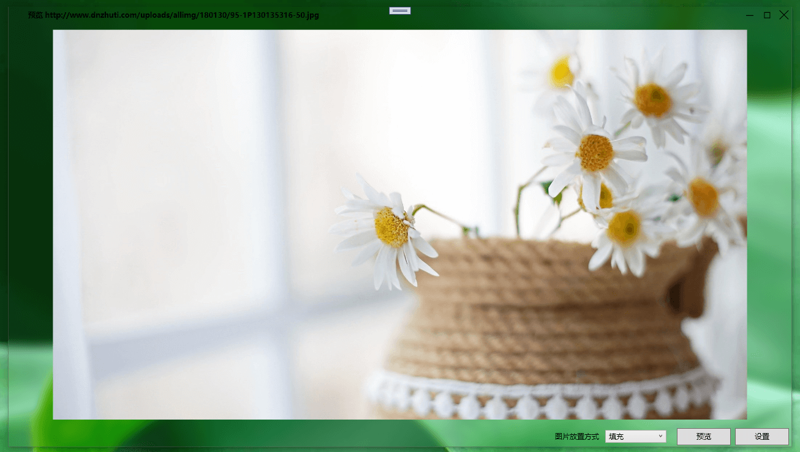

# Master-Zhao
Master-Zhao is a windows toolset software.  
Right here waiting to recall, just at that time already disconsolate.

<h1 align="center">Master-Zhao :hammer_and_wrench: </h1>

# Development environment
* .NET5
* Visual C++ Toolset 142
* Visual Studio 2019 16.10.4

# Build
Set the project to 64 bit

    

    

# List of features
## Beautify
  * Static wallpaper setting
  * Dynamic wallpaper setting
  * Mouse effect
  * Desktop effect
  * Taskbar setting
  * Context menu setting
  * Boot image setting
  * other
## System Tools
  * boot management
  * service management
  * background network management
  * windows settings
  * gpedit & register
  * fast search(taskbar win+q)
## Utilities
  * hardware information
  * startup assistant
  * fast run
## huá shuǐ

# Screenshot
<table align="center">
 <tr>
  <td colspan="2">main</td>
 </tr>
 <tr>
  <td colspan="2"> </td>
 </tr>
  <tr>
  <td colspan="2">static wallpaper</td>
 </tr>
 <tr>
  <td></td>
    <td></td>
 </tr>
 <tr>
  <td colspan="2">dynamic wallpaper</td>
 </tr>
 <tr>
  <td colspan="2"> </td>
 </tr>
 <tr>
  <td colspan="2">mouse effect</td>
 </tr>
 <tr>
  <td colspan="2"> </td>
 </tr>
</table>

# Development Plan
- [ ] transparency taskbar
- [ ] Windows 11 taskbar
- [ ] fast run

# License
[GPLV3](LICENSE)
