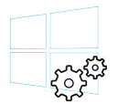
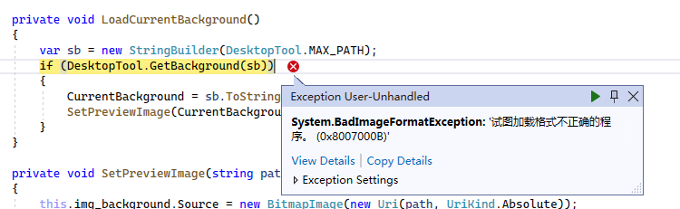
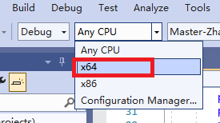
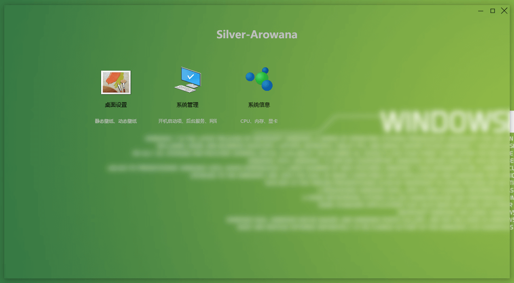
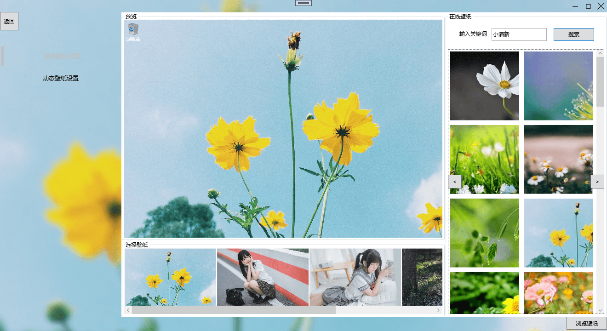
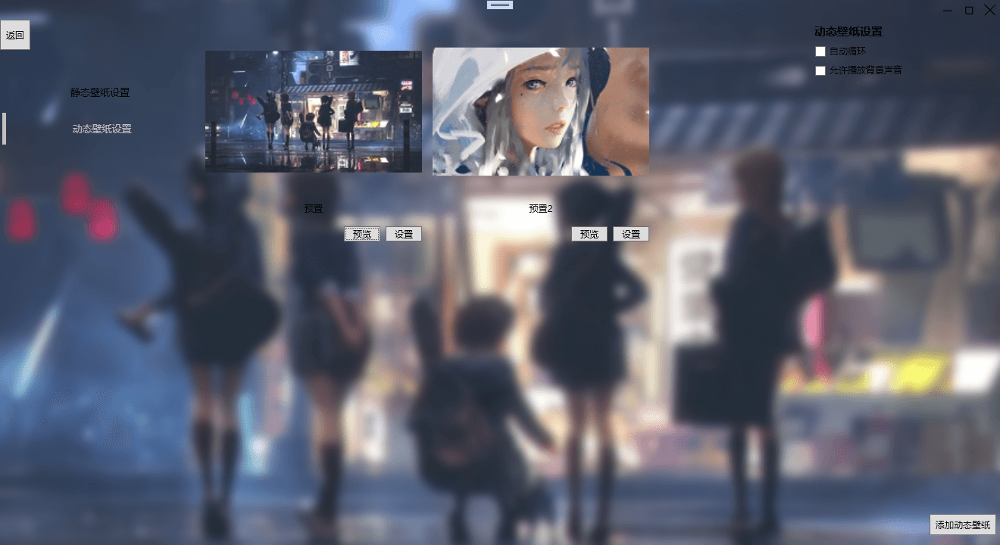
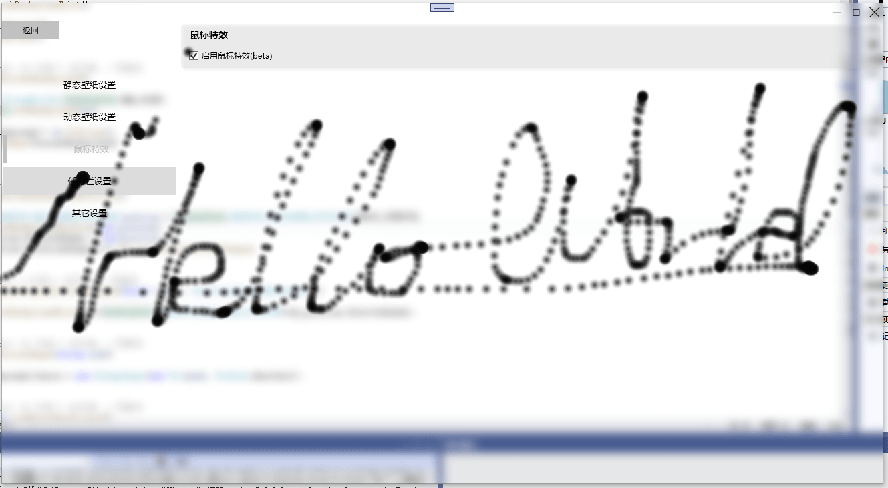
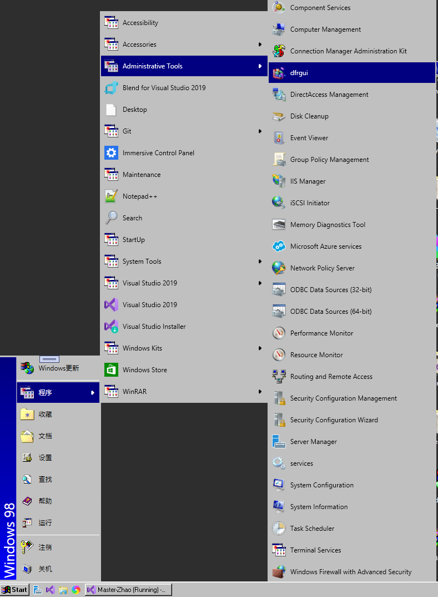
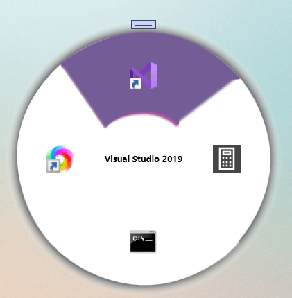
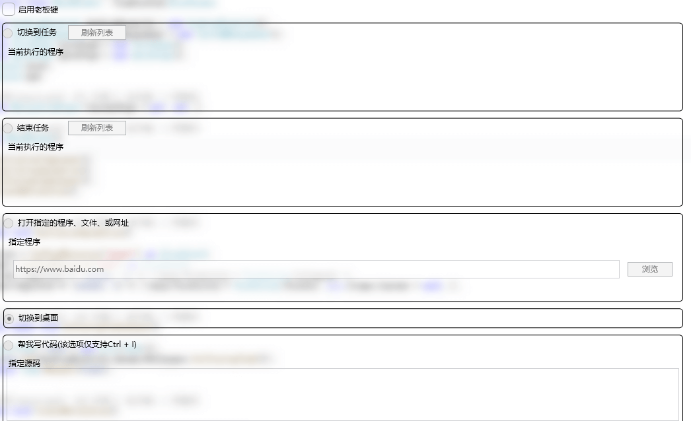

# Master-Zhao
Master-Zhao是Windows的一个工具集软件。 包括了美化、系统管理、小工具、划水等功能。  

为什么要写这样一个软件？  
07年时，在一个软件盘上，我第一次接触了Windows优化大师，当时的鲁大师还是作为Windows优化大师的一个附带工具安装的。Windows优化大师的很多功能都让我觉得很实用也很强大。作者鲁锦，是我心中当之无愧的大佬之一。    
Windows优化大师在2013年停止更新，鲁大师还在一直更新中。
时隔多年，我想用自己所学，也试着去做一些功能。也许有些技术已经不再受欢迎，又或许有些技术已经被淘汰，但仍然记得第一次在屏幕输出"Hello World"的那份喜悦。

<h1 align="center">Master-Zhao :hammer_and_wrench: </h1>

# 开发环境
* ~~.NET5~~ .NET Core 3.1
* Visual C++ Toolset 142
* Visual Studio 2019 16.10.4

# 构建
需要设置项目为x64

    

    

# 直接运行
如果不想编译代码直接运行 。安装.NET Core 3.1 Runtime 和Visual C++ 2019 x64 Redistributable Package后执行Master.Zhao.Shell.exe即可。
* [.NET Core 3.1 Runtime](https://dotnet.microsoft.com/zh-cn/download/dotnet/thank-you/runtime-desktop-3.1.27-windows-x64-installer)
* [Visual C++ 2019 Redistributable Package (x64)](https://aka.ms/vs/16/release/VC_redist.x64.exe)

# 功能列表
## 美化
  * 静态壁纸设置
  * 动态壁纸设置
  * 鼠标特效(基础版本)
  * 自定义开始菜单(基础版本)
  * 任务栏设置(部分功能)
## 实用工具
  * 老板键
  * 快速启动
      *  菜单启动

# 正在开发的功能
  * 实用工具 ->老板键
  
# 待完成的功能
## 美化
  * 桌面特效
  * 右键菜单管理
  * 开机图像修改
  * 其它
## 系统工具
  * 启动项管理
  * 服务管理
  * 后台网络管理
  * 系统设置
  * 组策略和注册表管理
  * 快速搜索（基于任务栏）
## 实用工具
  * 一键优化系统设置
  * 硬件信息
  * 开机助手
  * 快速启动
      *  一键启动
## 划水
     
# 功能介绍

**主界面**
 

**静态壁纸设置**
 

**动态壁纸设置**  
目前仅支持将本地视频设置为桌面背景，其它类型的动态壁纸后续再加入。  
 

**鼠标特效**
暂时只做了简单的版本，绘制了一些跟随的点。后面可以增加炫酷的效果  
 

**任务栏设置**
目前已经支持任务栏透明、Windows 11风格任务栏等设置，其它设置还在逐步完善中。  
**注意：如果任务栏或桌面显示异常，可以重启资源管理器进程。在任务管理器中找到explorer.exe重启即可**
 

**自定义开始菜单**
目前就做了一个简易版的Windows 98开始菜单，屏蔽了Win键和开始菜单按钮，其它方式打开开始菜单(如Ctrl + ESC)，还是会显示系统开始菜单。  
Windows 98开始菜单的一些功能还在完善中。  
 

**快速启动菜单**
这是一个支持快速启动的菜单，本来是想做成类似《古墓丽影 暗影》里武器切换的那种菜单效果。  
但是时间有限，也还存在一些技术难题，所以做了个简单的快速启动菜单。  
使用方法：在界面配置快速启动项后，按住Alt键，会在鼠标处显示菜单，此时，再按1/2/3/4数字键，即可运行相应的菜单项，也可以通过鼠标点击运行。  
 

<b>老板键</b> 
这是一个方便划水的功能，启动老板键功能后，可以选择5种响应方式  
分别是：切换到任务、结束任务、打开指定的程序、切换到桌面、帮我写代码。  
目前设置的按键是Alt + Q(方便左手单手使用),Ctrl + I(方便双手一起使用)。  
* 切换到任务:当老板键按下时，会切换到指定的进程。
* 结束任务:当老板键按下时，会结束指定的进程
* 打开指定的程序:可以支持网址、本地程序、控制面板项等，完整的支持项可以查看 https://github.com/zhaotianff/Windows-run-tool
* 切换到桌面:该功能和Win + D一样
* 帮我写代码：这个功能很魔幻，复制一段代码到代码框，然后打开开发环境，按下老板键，软件会自动帮你把刚才复制的代码重写一遍，假装自己在写代码。
**小提示：目前软件支持最小化到任务栏，老板键功能可以全天使用，愉快的划水**  
# License
[GPLV3](LICENSE)
